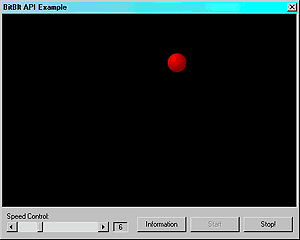



## Very Easy BitBlt

### Description

BitBlt is an API sub routine for painting graphics on a control that has a DC (Device Context). It's fast, flickerless, and used for 2D motion in most VB games. I wrote this for my cousin since he didn't understand BitBlt, he suggested I post it. (Like there aren't a million other BitBlt examples, this one is heavily commented though).
 
### More Info
 

             |
---                |---
**Submitted On**   |2000-12-27 08:56:24
**By**             |[Damage\.Case](https://github.com/Planet-Source-Code/PSCIndex/blob/master/ByAuthor/damage-case.md)
**Level**          |Beginner
**User Rating**    |4.0 (8 globes from 2 users)
**Compatibility**  |VB 4\.0 \(32\-bit\), VB 5\.0, VB 6\.0
**Category**       |[Graphics](https://github.com/Planet-Source-Code/PSCIndex/blob/master/ByCategory/graphics__1-46.md)
**World**          |[Visual Basic](https://github.com/Planet-Source-Code/PSCIndex/blob/master/ByWorld/visual-basic.md)
**Archive File**   |[CODE\_UPLOAD1309112272000\.zip](https://github.com/Planet-Source-Code/damage-case-very-easy-bitblt__1-13901/archive/master.zip)

